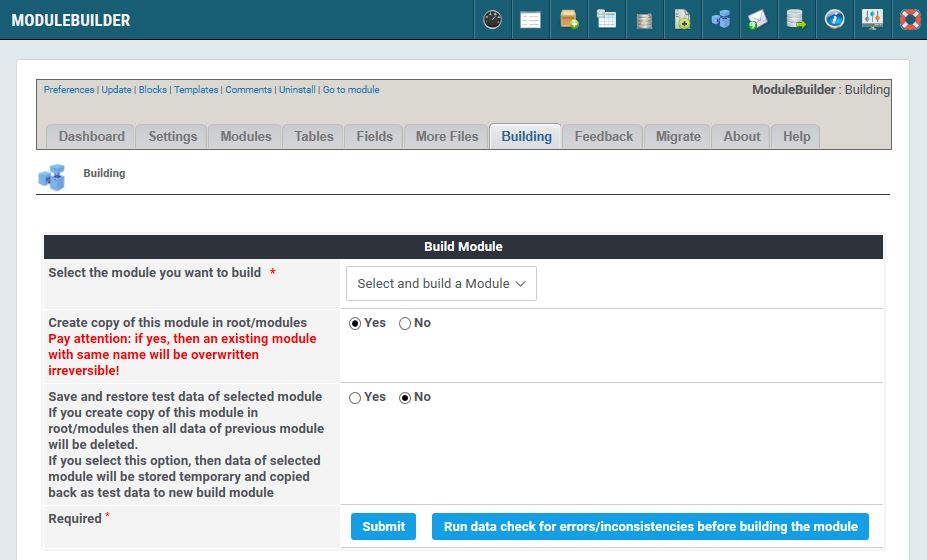

# Building

## 1. Overview

_Figure 12: Generating the new module \(Admin side\)_

You're finally done \(or you think so\), so it's time to generate the module.

### Create copy of this module in root/modules

By default ModuleBuilder writes the files to /uploads/modulebuilder/repository folder. 

Pay attention: if yes, then an existing module with same name will be overwritten irreversible!

But if you're sure that you want to overwrite you current files, you can select the module to overwrite. This will save you some time, as you don't have to copy the files from the /uploads folder.

### Save and restore test data of selected module

If you create copy of this module in root/modules then all data of previous module will be deleted.
If you select this option, then data of selected module will be stored temporary and copied back as test data to new build module

## 2. Run data check

Before you build the module you can run a data check to find out, whether your current settings have invalid or whether some functions will not work properly.

If data check finds no problems you will get this information back

If data check finds problems they will be listed

Important:

  * **Errors must be solved**

  * **Warnings should be solved in order to get proper functions**

