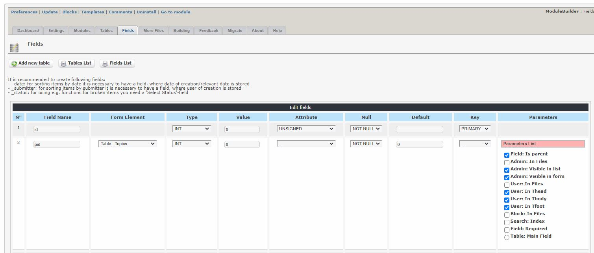

# Fields

_Figure 7: Fields \(Admin side\)_

Here you can see the tables, and you can edit the table settings, or you can edit the fields

_Figure 8: Expanding fields View \(Admin side\)_

Before you go to edit the individual fields, you can click on the left icon - it will expand the table showing all the fields. You can then change the visibility of each field, i.e. if it will be visible in the list and in the form for Admin, as well as for the User

_Figure 9: Fields details \(Admin side\)_

Here you can edit the details for each field.
