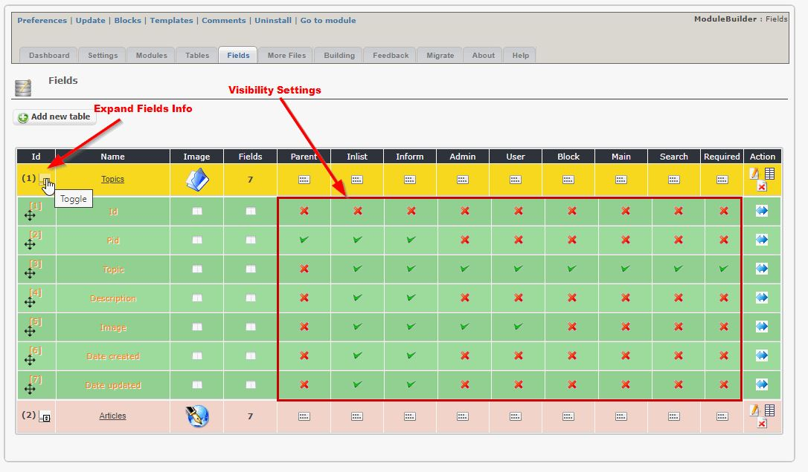

# Fields

## 1. Overview

_Figure 7: Fields \(Admin side\)_

Here you can see the tables, and you can edit the table settings, or you can edit the fields

_Figure 8: Expanding fields View \(Admin side\)_

Before you go to edit the individual fields, you can click on the left icon - it will expand the table showing all the fields. You can then change the visibility of each field, i.e. if it will be visible in the list and in the form for Admin, as well as for the User

_Figure 9: Fields details \(Admin side\)_

Here you can edit the details for each field.

## 2. Edit fields

### General recommendations

It is recommended to create following fields:
- date field: for sorting items by date it is necessary to have a field, where date of creation/relevant date is stored
- submitter field: for sorting items by submitter it is necessary to have a field, where user of creation is stored
- field status: for using e.g. functions for broken items you need a 'Select Status'-field

It is recommended to use a table prefix plus singular words, e.g. 'cat_logo' for logo image of the category.

###Fields

#### Field name

Enter a unique field name

#### Form Element

You can select between following form elements:

  * Textbox
  * Plain TextArea Field
  * Selectable Editor (Dhtml)
  * CheckBox
  * Radio Yes/No
  * Select Listbox
  * Select User Field
  * Color Picker Field
  * Image List
  * Select File Field
  * Url File Field
  * Upload Image Field
  * Upload File Field
  * Date Select Field
  * Select Status Field
  * Password Field
  * Select Country List
  * Select Language List
  * Date/Time Select Field
  * Select Combobox
  * Radio

#### Type

Please define the field type, e.g. VARCHAR, INT, ...

Depending on your selection in form element a type will be automatically suggested

#### Value

Please define the size

Depending on your selection in form element a size will be automatically suggested

#### Attribute
Please define the field attributes

#### Null

Please define whether null is allowed or not

#### Default

Please define default value for new items

#### Key

Please define the key, if you want to add one

#### Parameters

  * Field: Is parent => ???
  * Admin: In Files => field will be added to admin files
  * Admin: Visible in list => field will be visible in admin list
  * Admin: Visible in form => field will be visible in admin form
  * User: In Files => field will be added to user files
  * User index: in header => field will be visible in header of index file
  * User index: in body => field will be visible in body of index file
  * User index: in footer => field will be visible in footer of index file
  * User file: in header => field will be visible in header of table file
  * User file: in body => field will be visible in body of table file
  * User file: in footer => field will be visible in footer of table file
  * Block: In Files => field will be visible in blocks
  * Search: Index => field will be used in search function 
  * Field: Required => field will be an obligatory field
  * Table: Main Field => field will be the main field of this table (only one field can be main field)
  
Recommendations:

  * You shouldn't add a field in header and/or body and/or footer in the same time
  * If you select "User: In Files" you should display the field minimum one time in index or table file
