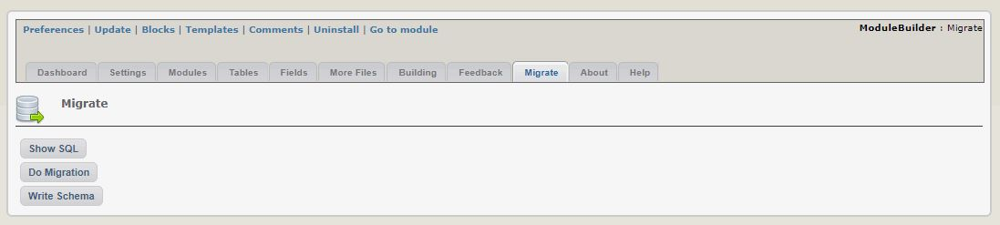
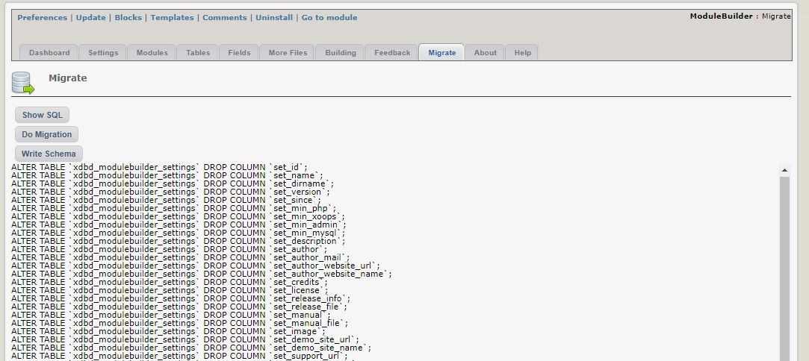
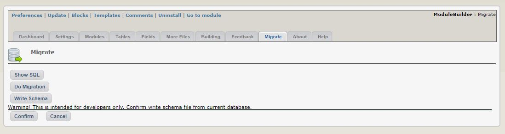
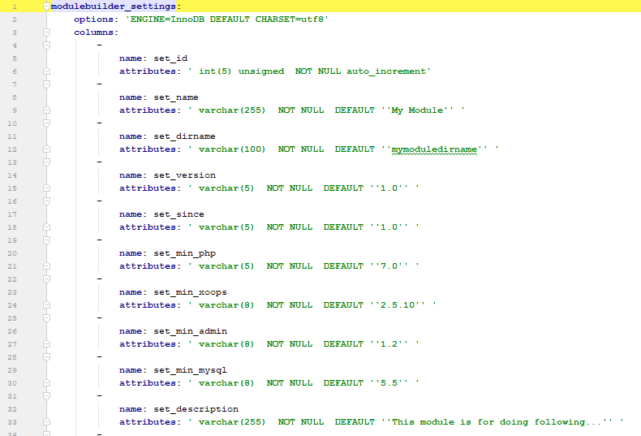

# Migrate

_Figure 14: Migrate \(Admin side\)_

For developers of the module, we provide a "Migration" option

_Figure 15: View SQL differences\(Admin side\)_

If the module database schema is in synch with the database, then there are no SQL commands here. However, since we just changed the version number of the module, there is no schema yet, therefore the "Show SQL" button shows all the code

_Figure 16: Writing the schema \(Admin side\)_

When you make changes to the ModuleBuilder database structure, you should update the schema stored in /sql folder.

_Figure 17: Module schema file \(Admin side\)_

This is how the schema file looks like. It will make updates from version to version much easier.