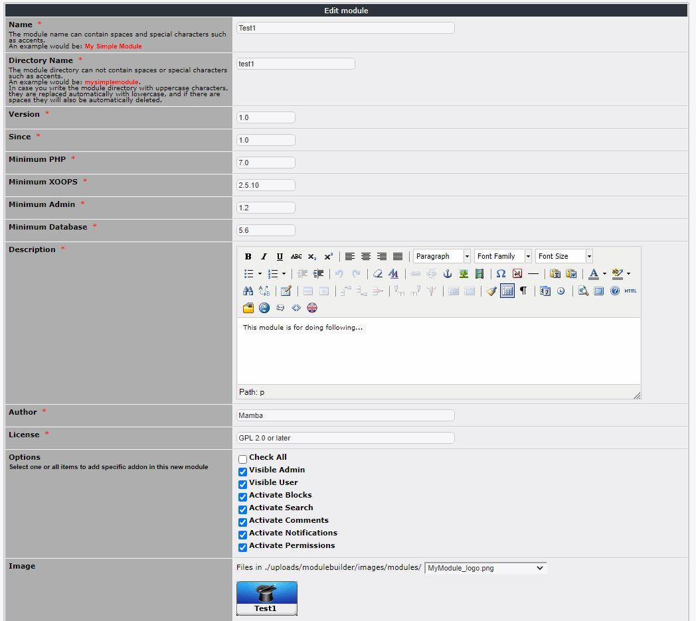

# Modules

## 1. Overview

_Figure 4a: Module List \(Admin side\)_

In this tab you can see list of all you modules that you've worked on.

In the overview you can also see the general options for your module.

## 2. Edit/create module

_Figure 4b: Module Settings\(Admin side\)_

Here you can define the details of your new module.

### Important information

#### Name

The module name can contain spaces and special characters such as accents.
An example would be: My Simple Module

#### Directory Name

The module directory can not contain spaces or special characters such as accents. An example would be: mysimplemodule.

In case you write the module directory with uppercase characters, they are replaced automatically with lowercase, and if there are spaces they will also be automatically deleted.

#### Options

Here you can define general options for your module, e.g. where it should be visible (admin and/or user side), whether the module contains blocks, comments, and so on.

#### Image

you can select an existing image from upload directory or create a new one. For creation of new one you select an icon and modulebuilder creates a new logo with this icon and the module name.