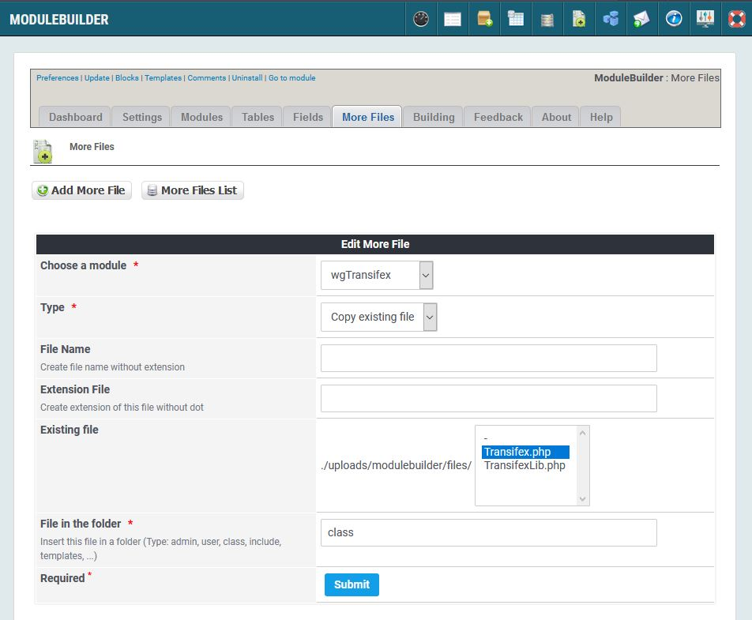

# More Files

_Figure 10: More files \(Admin side\)_

If you want to include additional files in a particular module, you can add them here

_Figure 11: More Files Edit view \(Admin side\)_

How have two possibillties to add own files to your module:

## Create empty file

You can add empty files. These files contains only header comments and/or header and footer.

You have to type in file name, type and destination folder.

## Copy file

If you have own files which you are always using in your files, then add them to directory '{root}\uploads\modulebuilder\files'.

Now you can select the file and type in destination folder, and each time you create a new version of your module this file will be added to your module.
