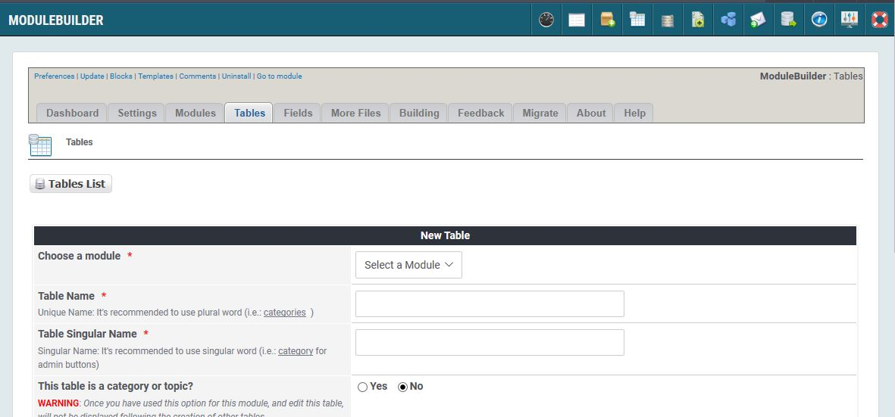

# Tables

## 1. Overview

_Figure 5: Table List \(Admin side\)_

In the Tables tab, you can see all you modules

_Figure 6: Expanding module \(Admin side\)_

Click on this icon to expand the module and show all its tables. On the right hand sid you can click on the icons to edit the module, or to see all the fields defined in the table

## 2. Edit/create table

### Important information

#### Table Name
Unique Name: It's recommended to use plural word (i.e.: categoriess)

#### Table Singular Name
Singular Name: It's recommended to use singular word (i.e.: category for admin buttons)

#### This table is a category or topic?
If you define a table a category then you can take the content of this table in other tables as select box

#### Prefix Field Name
This is the prefix of field name (optional)
If you leave the field blank, doesn't appear anything in the fields of the next screen,
otherwise you'll see all the fields with a prefix type (i.e.: cat of table categories).
WARNING: It's recommended to use singular word

#### Number fields
Number of fields for this table

#### Table Logo
WARNING: If you want to choose a new image, is best to name it with the module name before and follow with the name of the image so as not to overwrite any images with the same name, in the Frameworks/moduleclasses/moduleadmin/icons/32/. Otherwise an other solution, would be to insert the images in the module, a new folder is created, with the creation of the same module - assets/icons/32.
Files in ./Frameworks/moduleclasses/icons/32/  

#### Auto Increment
Check this option if table have the Auto Increment ID

#### Options
For each table created, a file is created on behalf of this.
Selecting one or more of these options to decide which functions and condition should be implemented in your module for this table.

  * Add in Install file: table will be included in install.php
  * Add in User Index file: table will be included in index.php
  * Add in Block Files: table will be included in block files
  * Add in Admin Files: table will be included in admin files and for each table a seperate menu item will be created
  * Add in User Files: table will be included on user side and file for this table will be created
  * Add in Submenu: table will be added as submenu item in main menu
  * Add Submit Function: add submit function to user files
  * Add in Tag file
  * Add Broken Function: add broken function to user files and broken handling to admin side
  * Add Search Function: add table to search functions
  * Add Comments Function: add table to search functions
  * Add Notifications Function: add table to search functions
  * Add in Permissions Function: add table to search functions
  * Add in Rate file: add table to rating system
  * Add in Print file
  * Add in Pdf file
  * Add in Rss file
  
