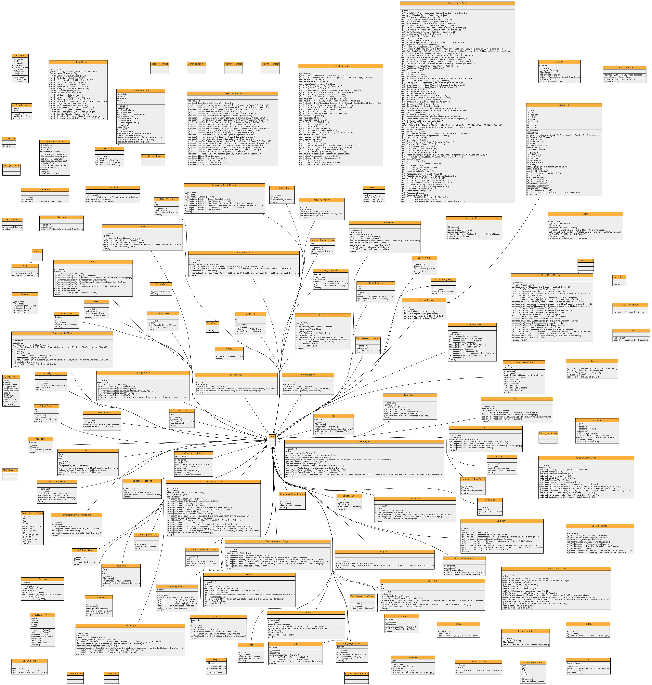
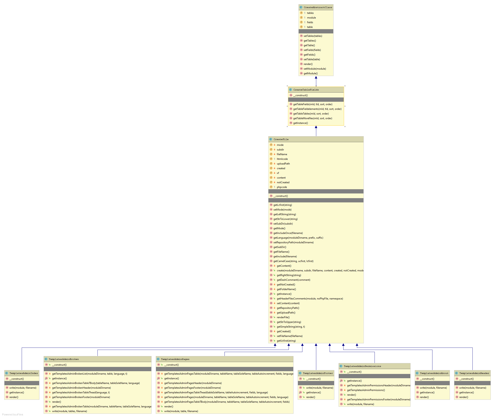
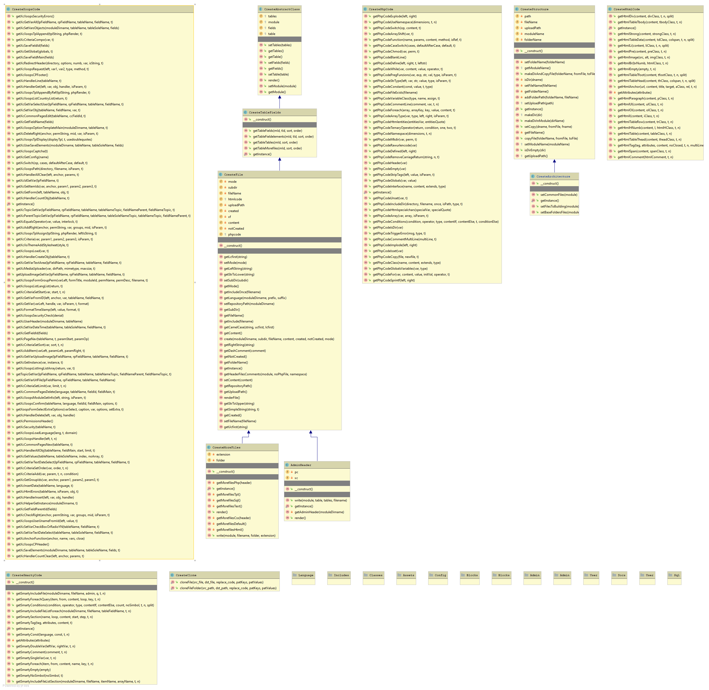
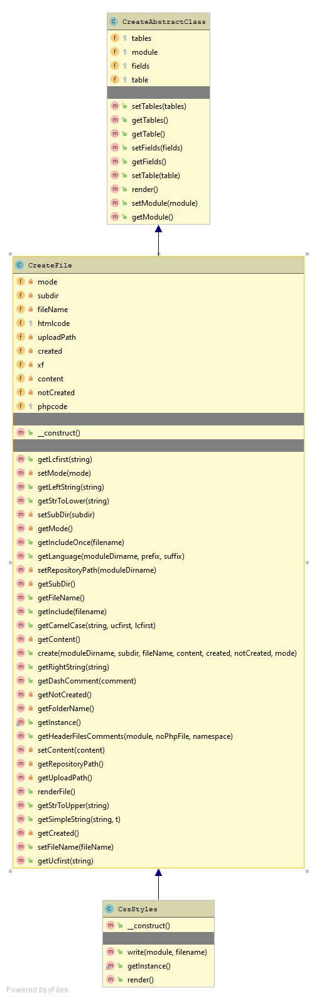
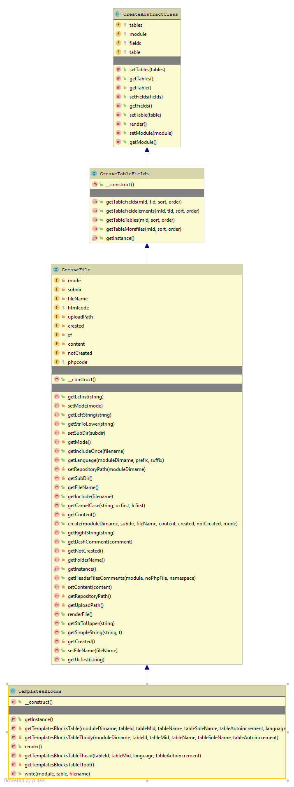
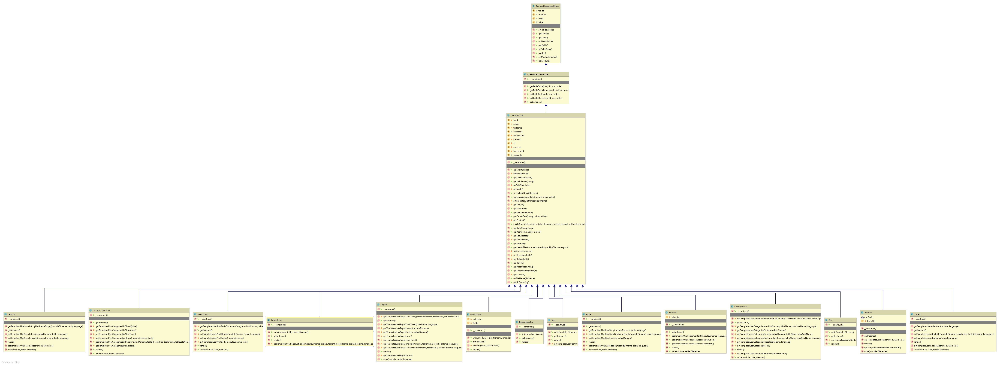

# UML Classes

_Figure 8.2: Overall view of the module_

_Figure 8.2: Admin Classes_

_Figure 8.2: Various classes_

_Figure 8.2: CSS Styles_

_Figure 8.2: Template Blocks_

_Figure 8.2: UserDefstyle Classes_

