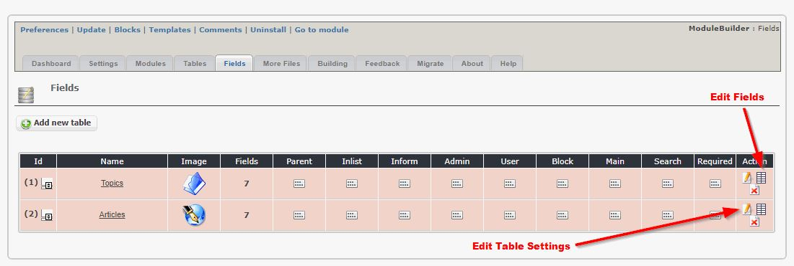

# 2.0 Administration Menu

*Figure 1: Main view of the ModuleBuilder (Admin side)*

### Dashboard

*Figure 2: Import and Export of your current database (Admin side)*

When you start working with XOOPS ModuleBuilder, you can import our sample definition of a module. 
This will help you to understand the settings of a module, its tables, and individual fields.

If you create a very cool module, you can export the database and share with others, so they can import it and improve it or customize for their individual needs.

 
### Settings

*Figure 3: Module Settings (Admin side)*

You can define the Default settings for your future modules. Every new module will start with these values 

### Modules

*Figure 4a: Module List (Admin side)*

In this tab you can see list of all you modules that you've worked on.

*Figure 4b: Module Settings(Admin side)*

Here you can define the details of your new module.

### Tables

*Figure 5: Table List (Admin side)*

In the Tables tab, you can see all you modules

*Figure 6: Expanding module (Admin side)*

Click on this icon to expand the module and show all its tables. On the right hand sid you can click on the icons to edit the module, or to see all the fields defined in the table

### Fields

*Figure 7: Fields (Admin side)*

Here you can see the tables, and you can edit the table settings, or you can edit the fields

*Figure 8: Expanding fields View (Admin side)*

Before you go to edit the individual fields, you can click on the left icon - it will expand the table showing all the fields.
You can then change the visibility of each field, i.e. if it will be visible in the list and in the form for Admin, as well as for the User

*Figure 9: Fields details (Admin side)*

Here you can edit the details for each field.

### More Files

*Figure 10: More files (Admin side)*

If you want to include additional files in a particular module, you can add them here

*Figure 11: More Files Edit view (Admin side)*

This is the information that you have to provide for the additional files

### Building Module

*Figure 12: Generating the new module (Admin side)*

You're finally done (or you think so), so it's time to generate the module. 

To make sure that you don't overwrite you code, the default is to write the files to /uploads/modulebuilder/repository folder. 
But if you're sure that you want to overwrite you current files, you can select the module to overwrite. This will save you some time, as you don't have to copy the files from the /uploads folder.

### Feedback

*Figure 13: Feedback (Admin side)*

Here you have the option to provide feedback and recommendations to the developers

### Migrate

*Figure 14: Migrate (Admin side)*

For developers of the module, we provide a "Migration" option

*Figure 15: View SQL differences(Admin side)*

If the module database schema is in synch with the database, then there are no SQL commands here. 
However, since we just changed the version number of the module, there is no schema yet, therefore the "Show SQL" button shows all the code  

*Figure 16: Writing the schema (Admin side)*

When you make changes to the ModuleBuilder database structure, you should update the schema stored in /sql folder. 

*Figure 17: Module schema file (Admin side)*

This is how the schema file looks like. It will make updates from version to version much easier.

### About

*Figure 18: About information (Admin side)*

Some additional information about this module, incl. the changelog

### Help

*Figure 19: Help view (Admin side)*

Every module contains a Help information. 

