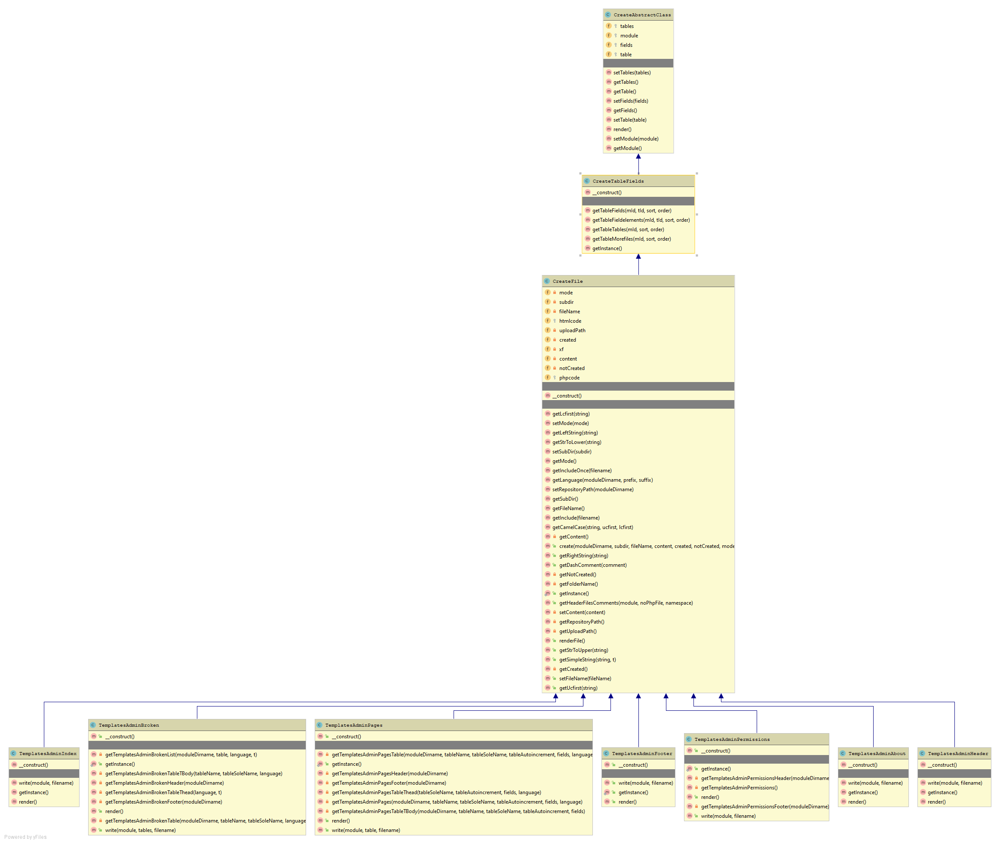
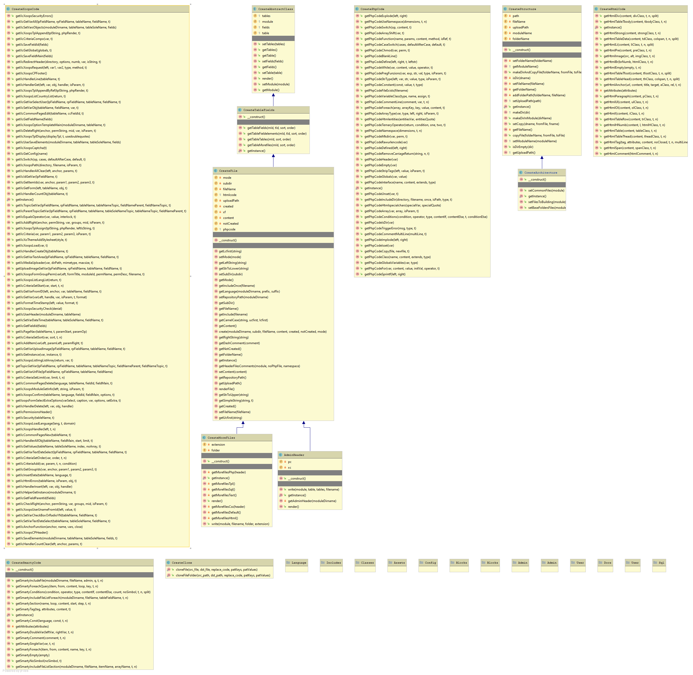
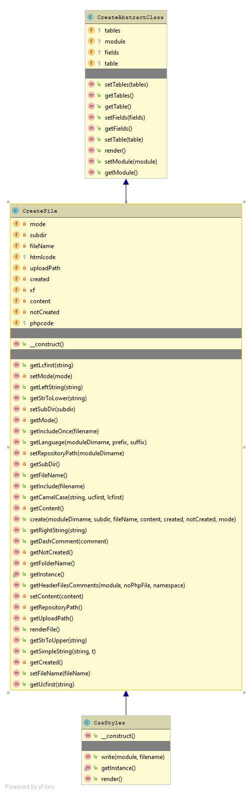
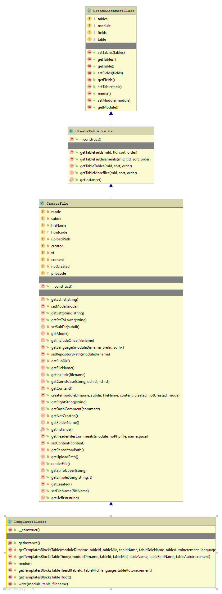
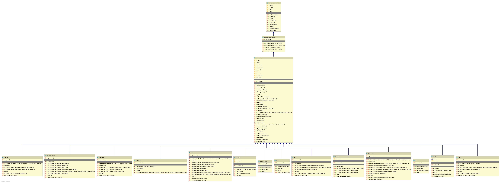

# 8.2 UML Class Diagrams

*Figure 8.2:  Overall view of the module*

*Figure 8.2:  Admin Classes*

*Figure 8.2:  Various classes*

*Figure 8.2:  CSS Styles*

*Figure 8.2:  Template Blocks*

*Figure 8.2: UserDefstyle Classes*
